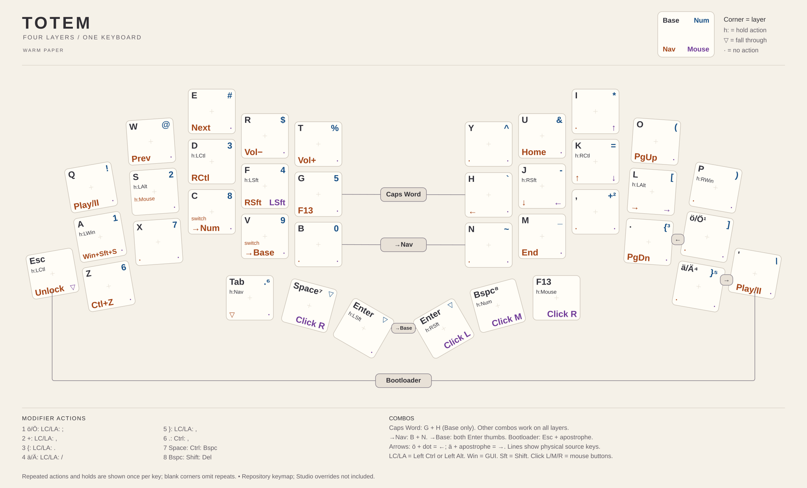
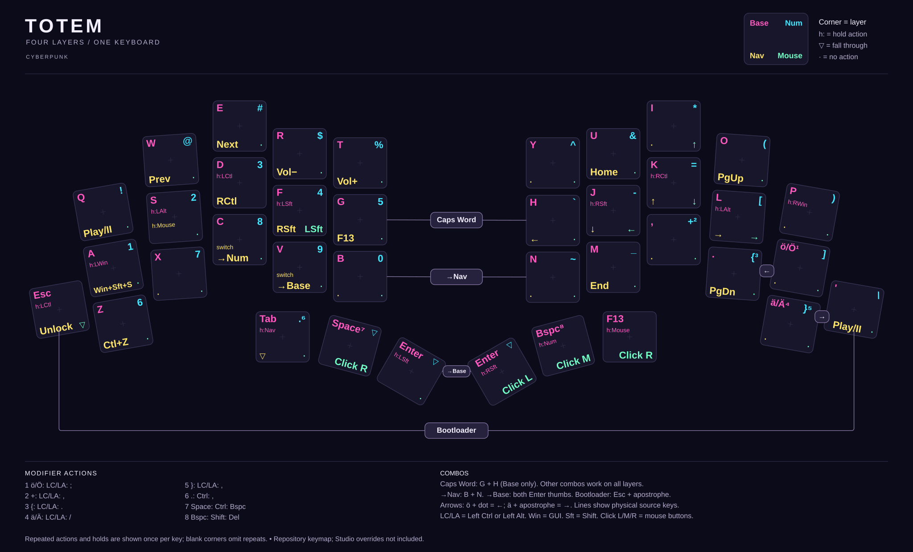
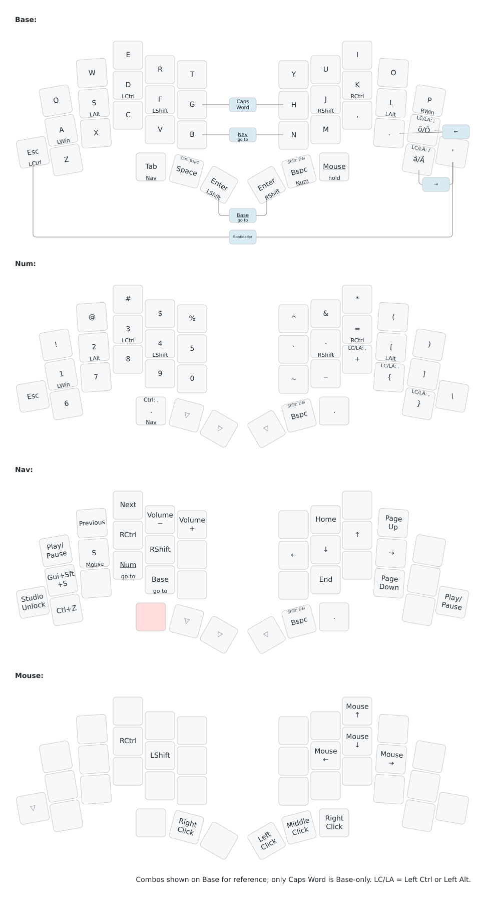

# TOTEM + Prospector on current ZMK

Personal 38-key TOTEM configuration with two Seeed XIAO nRF52840 halves and a XIAO-based Prospector display dongle. The dongle is the central; both keyboard halves connect to it wirelessly. USB Studio access is enabled on the dongle.

This migration starts from [tharj/zmk-config-2, commit 278074e](https://github.com/tharj/zmk-config-2/tree/278074e322a3eed99a44d1fc16884020235c6130). The original repository remains the working ZMK v0.3 fallback.

## Firmware

Open [Build firmware](https://github.com/tharj/zmk-config-totem-prospector/actions/workflows/build.yml), select a successful run, and download its `firmware` artifact. Every push or manual workflow run builds:

| File | Device |
| --- | --- |
| `totem_left.uf2` | Left TOTEM half |
| `totem_right.uf2` | Right TOTEM half |
| `totem_dongle_classic.uf2` | Prospector dongle, Classic screen |
| `totem_dongle_radii.uf2` | Prospector dongle, Radii screen |
| `totem_dongle_field.uf2` | Prospector dongle, Field screen |
| `totem_dongle_operator.uf2` | Prospector dongle, Operator screen |
| `settings_reset.uf2` | Optional settings reset for any of the three XIAO controllers |

For a full migration, use the left-half image, right-half image, and one chosen dongle image from the same successful run. Enter each controller's UF2 bootloader and copy its matching UF2 to the mounted drive. Settings reset is a recovery tool, not the normal keyboard firmware.

## Current dependencies

| Component | Tracked revision |
| --- | --- |
| ZMK and its official build workflow | `main` |
| Zephyr and LVGL | Versions selected by ZMK's manifest |
| Prospector | `feat/new-status-screens`, the upstream Zephyr 4.1-compatible branch |
| ZMK Unicode | `main` |

As of the migration, the latest published ZMK release is still v0.3.0. This repository intentionally follows current development to use the newer platform. Prospector's compatible branch is marked work in progress upstream. Branches can change between builds; preserve a successful firmware ZIP before rebuilding. Moving to a future stable release means changing both the ZMK revision and reusable workflow reference together after checking module compatibility.

The root `CMakeLists.txt` enables a small compatibility header in `compat/include/` that supplies the missing ZMK keycode include when the Unicode behavior loads its header. It preserves the required system-header order and leaves upstream source files untouched. Remove this workaround once the missing include is fixed upstream.

## Keymap drawings

### All four layers on one keyboard



[Light SVG](keymap-drawer/totem-overview-light.svg) · [Light PNG](keymap-drawer/totem-overview-light.png)



[Dark SVG](keymap-drawer/totem-overview-dark.svg) · [Dark PNG](keymap-drawer/totem-overview-dark.png)

Each key uses the same corner arrangement: **Base top-left, Num top-right, Nav bottom-left, Mouse bottom-right**. Warm paper uses charcoal, deep blue, burnt orange, and purple. Cyberpunk uses neon pink, cyan, yellow, and mint. Smaller `h:` labels show holds; superscripts refer to modifier-action notes. Repeated actions and hold labels are shown once per physical key (first occurrence in Base, Num, Nav, Mouse order); blank corners omit repeated labels. Modifier-dependent actions stay distinct, and cursor arrows are not merged with mouse movement. Labels expand into unused space, and the larger combo badges keep clear of the key text. `▽` means transparent (fall through to the next active lower layer), while `·` means no action. `→Base` and `→Num` switch layers. The corner legend, notes, and combo explanation are included in each image.

Adjacent arrow combos sit at the midpoint of their source keys. Caps Word (G+H), Nav (B+N), and Base (both Enter thumbs) are centered between their sources. The Bootloader connector runs below the keyboard so it clears the thumb cluster. Combo bindings and firmware behavior are unchanged.

### Individual layers



[Open SVG](keymap-drawer/totem.svg) · [Download PNG](keymap-drawer/totem.png) · [Drawing workflow](https://github.com/tharj/zmk-config-totem-prospector/actions/workflows/draw-keymap.yml)

Drawings use the same physical coordinates and rotations as the firmware. All combos are displayed on Base for readability; only Caps Word is restricted to Base in the actual keymap. Key centers show tap actions, bottom labels show holds, and top labels describe modifier morphs. `LC/LA` means Left Ctrl or Left Alt; uppercase Ä/Ö uses Shift. Pink keys mark an inferred layer-entry key, not a required chord.

The drawing Action runs when the keymap, shield, or drawing configuration changes, and can also be run manually. It publishes a `keymap-drawings` artifact containing the individual-layer and both overview SVGs/PNGs, plus parsed YAML, and updates the committed drawings on `main`. Pull requests generate an artifact without committing. Images reflect the repository keymap, not saved ZMK Studio overrides. HRM timings are documented below rather than printed on the layers.

To regenerate locally with Python 3.12 or later:

```sh
python -m pip install -r keymap-drawer/requirements.txt
python scripts/draw-keymap.py
```

The individual-layer appearance, parser legends, and combo placement are configured in `keymap-drawer/config.yaml`. `scripts/draw-overview.py` combines the freshly parsed four layers using keymap-drawer corner labels and adds theme colors, hold annotations, a legend, and modifier notes. Both themes regenerate with the same command; no manual duplication of the firmware bindings is needed. Generated files should not be edited by hand. PNG conversion uses resvg; Actions installs DejaVu Sans for consistent font rendering.

## Keymap and behavior

Edit `config/totem.keymap`. The shield default includes that same file, so there is only one personal keymap to maintain.

- Layers: Base (0), Num (1), Nav (2), Mouse (3).
- OS-key hold-taps: tap-preferred, 280 ms prior idle, 450 ms tapping term, 175 ms quick tap; includes GUI/1 on Num.
- Other home-row hold-taps: balanced, 130 ms prior idle, 280 ms tapping term, 175 ms quick tap.
- Opposite-hand and thumb positional triggers are retained, including the corrected Q position.
- Outer right thumb taps F13 and holds Mouse on Base and Num using the standard layer-tap (tap-preferred, 200 ms; quick-tap and prior-idle overrides disabled). On Nav, that thumb and the physical G key both send plain F13. Mouse-layer bindings are unchanged: the outer right thumb remains right-click. Right-click is also available on the left Space thumb while Mouse is active.
- On Num, the left Dot/Nav thumb taps `.` normally or `,` with either Ctrl held; Ctrl is suppressed for that comma. Holding still activates Nav (tap-preferred, 200 ms), including while Ctrl is held. Space and Enter remain on the other left thumbs.
- Other modifier morphs, combos, Shift/Enter thumbs, Tab/Nav, and Backspace/Num behavior are preserved.
- Unicode ä/ö still uses WinCompose with Right Alt as the compose key. Keep the host's US layout and existing WinCompose setup.

The layer constants now agree with the actual layer order. The B+N combo is named `ToNav` to reflect its existing action; its destination has not changed.

## Prospector

Actions builds Classic, Radii, Field, and Operator as separate dongle firmware files in the `firmware` ZIP. Each target selects its layout with one `CONFIG_PROSPECTOR_STATUS_SCREEN_...=y` setting in `build.yaml`. They share brightness 30%, disabled ambient-light sensing, Windows-style modifier settings, and the same keymap. Flash only the desired dongle image to switch screens; the halves do not need reflashing for a screen-only change. Screen selection is compiled in, not a runtime menu. `totem_dongle_classic.uf2` replaces the previous `totem_dongle_prospector.uf2` filename. The current module provides active layer names, peripheral battery/connection status, output status, active modifiers, and Caps Word indication.

Radio settings and peripheral battery reporting are retained. Device-specific display, mouse, and central settings live in `config/totem_dongle.conf`; common radio and Unicode timing settings live in `config/totem.conf`.

If re-pairing is needed, follow [ZMK's split connection troubleshooting](https://zmk.dev/docs/troubleshooting/connection-issues). For correct left/right battery ordering, pair the left half before the right, as described by Prospector upstream. A settings reset clears saved pairing and other settings; flash the correct normal firmware again afterward.

## Validation

A successful Actions run verifies compilation and artifact packaging. Physical testing is still needed for all 38 keys, the new HRM timings, Unicode, mouse buttons, USB/Studio, wireless reconnect after power cycling, and the Prospector layer, Caps Word, and battery indicators. Existing Studio overrides may differ from this compiled keymap; check or reset those overrides if the flashed map does not match the source.

## Repository layout

- `config/`: personal keymap, settings, and West dependency manifest.
- `boards/shields/totem/`: matrix wiring, physical layout, and shield definitions.
- `zephyr/module.yml`: unified configuration/module registration.
- `build.yaml`: modern `xiao_ble//zmk` build targets and firmware names.
- `.github/workflows/build.yml`: official reusable ZMK build workflow.

## Upstream projects

- [ZMK](https://github.com/zmkfirmware/zmk) and its [current hardware migration guide](https://zmk.dev/blog/2025/12/09/zephyr-4-1).
- [TOTEM hardware](https://github.com/GEIGEIGEIST/TOTEM).
- [Prospector module and setup instructions](https://github.com/carrefinho/prospector-zmk-module/tree/feat/new-status-screens).
- [ZMK Unicode](https://github.com/urob/zmk-unicode).
- [Unified ZMK configuration template](https://github.com/zmkfirmware/unified-zmk-config-template).

Original source copyright notices have been preserved.
